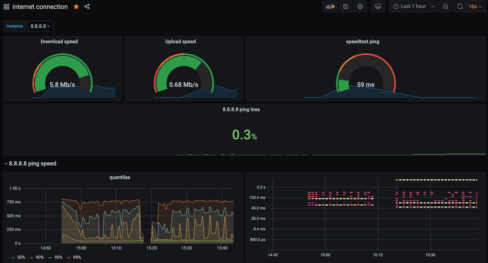

# A Docker Stack which Monitors your home network
Here's a quick start to stand-up a Docker [Prometheus](http://prometheus.io/) stack containing Prometheus, Grafana with  [blackbox-exporter](https://github.com/prometheus/blackbox_exporter), [speedtest-exporter](https://github.com/MiguelNdeCarvalho/docker-speedtest_exporter), [homehub-metrics-exporter](https://github.com/jamesnetherton/homehub-metrics-exporter) and [smokeping_prober](https://github.com/SuperQ/smokeping_prober) to collect and graph home network connections and speed. It is based loosely on the repo by [maxandersen](https://github.com/maxandersen/internet-monitoring).

## Pre-requisites
Before we get started installing the Prometheus stack. Ensure you install the latest version of docker and [docker-compose](https://docs.docker.com/compose/install/) on your Docker host machine. This has been tested deployed on the raspberry pi with arm32 but it should be compatable with other architectures.

# Quick Start
Clone the repo onto the device you would like to run on.

## Configuration
You must add the hosts you will be query in the blackbox exporter. You may also override the hosts you ping against.

Add a file ./prometheus/blackbox.yaml of the format:

```
- targets:  # url;humanname;routing;switch
    - google.com;google.com;external;internetbox
    - github.com;github.com;external;internetbox
```
and a file ./docker-compose.override.yaml
```
services:
  smokeping:
    command:
      - 'google.com'
      - 'github.com'
```

You must have an environment file containing auth config for the bt hub and grafana. NB. Grafana will only provision the admin once so if you change the auth config after your first deploy you will need to delete the grafana volume. `docker volume ls` and `docker volume rm` are useful for this.

Create a file hub/auth.env file with the following:

```
HUB_USERNAME=[admin username]
HUB_PASSWORD=[admin password]
```

Create a file grafana/auth.env file with the following:

```
GF_SECURITY_ADMIN_PASSWORD=[choose some password]
GF_SECURITY_ADMIN_USER=[choose some password]
```

The speed test is configured in [/prometheus/prometheus.yml](./prometheus/prometheus.yml). There is a default `scrape_interval` under `speedtest` which sets the interval for each speed test. You may need to override the default if this is not appropriate for your needs (eg. the test is degrading your performance).

## Deploy
Once you have made your configurations, from the root of the repo run the following command:

    $ docker-compose up -d

After a few moments the Grafana Dashboard will be accessible via: `http://<Host IP Address>:3000` for example http://localhost:3000

The DataSource and Dashboards for Grafana are automatically provisioned. 

<center></center>

## Interesting urls
Note: replace `localhost` with your docker host ip/name if not running this locally.

http://localhost:9090/targets shows status of monitored targets as seen from prometheus - in this case which hosts being pinged and speedtest. note: speedtest will take a while before it shows as UP as it takes ~30s to respond.

http://localhost:9090/graph?g0.expr=probe_http_status_code&g0.tab=1 shows prometheus value for `probe_http_status_code` for each host. You can edit/play with additional values. Useful to check everything is okey in prometheus (in case Grafana is not showing the data you expect).

http://localhost:9115 blackbox exporter endpoint. Lets you see what have failed/succeded.

http://localhost:9800/metrics speedtest exporter endpoint. Does take ~30 seconds to show its result as it runs an actual speedtest when requested.

http://localhost:19092/metrics BT homehub metrics.

http://localhost:9100/metrics Node-exporter for the node this is deployed on.

http://smokeping:9374/metrics Smokeping exporter metrics.
